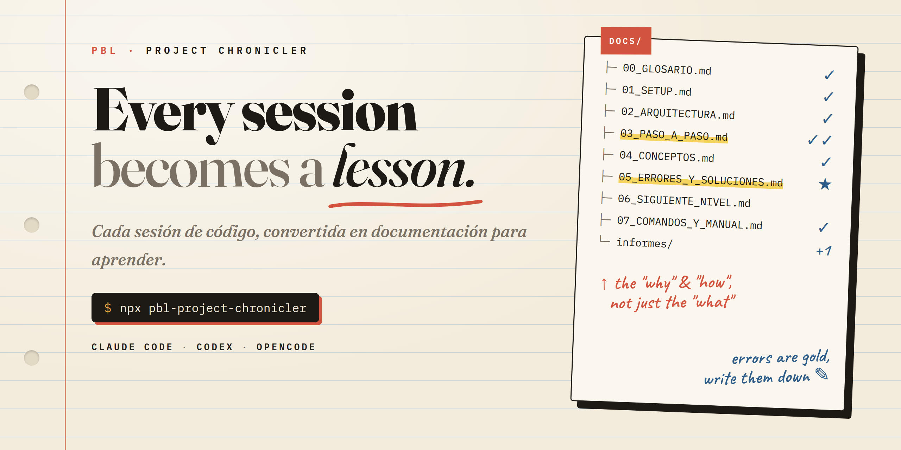

<div align="center">



# 📚 PBL Project Chronicler

**Crear mientras aprendes, aprender mientras creas.**

Una skill para **Claude Code**, **Codex** y **OpenCode** que convierte cada sesión de desarrollo en documentación de aprendizaje: glosario, paso a paso reproducible, errores reales y sus soluciones.

[](https://www.npmjs.com/package/pbl-project-chronicler)
[](LICENSE)


</div>

---

## ¿Qué hace?

Le dices a tu agente **"activa el chronicler"** y, mientras programas, escribe por ti una carpeta `docs/` pensada para que *tú dentro de seis meses* — o alguien que nunca ha programado — pueda reproducir lo que hiciste y entender **por qué**.

También es **un Plus bastante interesante para cualquier sesión de vibe coding, para aprender de cada paso y documentar todo ese conocimiento potencial** para ser estudiado y analizado cuando quieras.

```
docs/
├── README.md                    ← Portada del proyecto
├── 00_GLOSARIO.md               ← Cada término técnico, con analogía
├── 01_SETUP.md                  ← Entorno desde cero
├── 02_ARQUITECTURA.md           ← Decisiones y sus porqués
├── 03_PASO_A_PASO.md            ← El corazón: el proceso real
├── 04_CONCEPTOS.md              ← Lo aprendido
├── 05_ERRORES_Y_SOLUCIONES.md   ← Errores reales = oro pedagógico
├── 06_SIGUIENTE_NIVEL.md        ← Mejoras futuras
├── 07_COMANDOS_Y_MANUAL.md      ← Chuleta de comandos
└── informes/                    ← Un informe por task terminada
```

## Instalación

### Opción 1 — npm (detecta tus agentes)

```bash
npx pbl-project-chronicler              # instala en cada agente detectado
npx pbl-project-chronicler --claude     # ~/.claude/skills
npx pbl-project-chronicler --codex      # ~/.codex/skills
npx pbl-project-chronicler --opencode   # ~/.config/opencode/skills
npx pbl-project-chronicler --global     # ~/.agents/skills (estándar compartido)
npx pbl-project-chronicler --uninstall  # elimina de todas
```

| Agente | Dónde busca skills |
|---|---|
| Claude Code | `~/.claude/skills` |
| Codex | `~/.codex/skills`, `~/.agents/skills` |
| OpenCode | `~/.config/opencode/skills`, `~/.claude/skills`, `~/.agents/skills` |

### Opción 2 — Plugin de Claude Code

```bash
claude plugin marketplace add D4vRAM369/pbl-project-chronicler
claude plugin install pbl-project-chronicler@pbl-project-chronicler
```

O dentro de Claude Code: `/plugin marketplace add D4vRAM369/pbl-project-chronicler`.

### Opción 3 — Plugin de Codex

```bash
codex plugin marketplace add https://github.com/D4vRAM369/pbl-project-chronicler.git
codex plugin add pbl-project-chronicler
```

### Opción 4 — Manual

```bash
git clone https://github.com/D4vRAM369/pbl-project-chronicler.git
cp -r pbl-project-chronicler/skills/pbl-project-chronicler ~/.claude/skills/
```

## Uso

| Dices | Pasa |
|---|---|
| "activa el chronicler" | Crea `docs/` y empieza a documentar |
| "documenta esto" | Documenta el código/decisión actual |
| "añade al glosario: X" | Añade el término con analogía y ejemplo |
| "documenta el error" | Registra causa raíz y solución |
| "haz informe de la task" | Crea `docs/informes/YYYY-MM-DD-slug.md` |
| "cierra la sesión" | Resumen de sesión + actualiza todo |

> 💡 Al activarse pregunta si `docs/` va al repo o a `.gitignore` (documentación local de aprendizaje).

## Principios

1. **Nunca solo el "qué"** — siempre el "por qué".
2. **Los errores son contenido premium.**
3. **Reproducible por un extraño.**
4. **El camino imperfecto es el más educativo** — no se reescribe la historia.

## Estructura del repo

```
.claude-plugin/        ← manifiesto + marketplace de Claude Code
.codex-plugin/         ← manifiesto de Codex
.agents/plugins/       ← marketplace de Codex
skills/pbl-project-chronicler/
├── SKILL.md           ← la skill
└── references/        ← plantillas y ejemplos
bin/install.js         ← instalador npx
```

## Licencia

[MIT](LICENSE)
